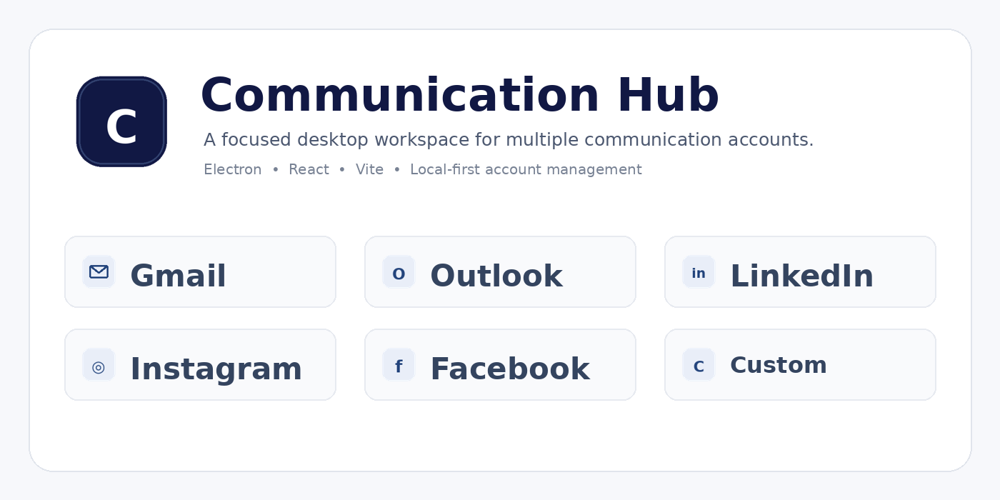

# Communication Hub

> **A lightweight, local-first desktop workspace for managing multiple communication-service accounts from one focused interface.**

[](./package.json)
[](https://www.electronjs.org/)
[](https://react.dev/)
[](https://vitejs.dev/)
[](#building-the-application)

<p align="center">
  
</p>

<p align="center">
  <strong>Communication Hub</strong> brings supported communication services, account management, limits, and local session controls into one desktop utility.
</p>

---

## ✨ Highlights

- 🖥️ **Desktop-first experience** built with Electron.
- ⚛️ **Modern React UI** powered by Vite.
- 👤 **Multi-user local profiles** with owner and managed-user support.
- 🔐 **6-digit PIN authentication** for local application access.
- 🧩 **Multiple accounts per service**, subject to configured limits.
- 🗂️ **Per-account isolated browser sessions** using Electron persistent partitions.
- ⚙️ **Central Settings workspace** for account management, limits, connected services, and app information.
- 🧹 **Clear All Local Session Data** flow for removing connected-service session data while preserving the local owner profile.
- 🔄 **Custom web services** can be registered and managed like built-in services.
- 📏 **Configurable account limits** per user and per service.
- 🔠 **UI text scaling** from 85% to 115%.
- 🪟 **Floating sidebar** that stays available while service windows are open.
- 📜 **Consistent scrolling** for large account lists, Settings, and modal content.
- 🖥️ **Cross-platform packaging** for Windows, macOS, and Linux.

---

## 🖼️ Supported Services

<p align="center">
  
  &nbsp;&nbsp;
  
  &nbsp;&nbsp;
  
  &nbsp;&nbsp;
  
  &nbsp;&nbsp;
  
  &nbsp;&nbsp;
  
</p>

### Built-in integrations

| Service        | Category     | Account support   |
| -------------- | ------------ | ----------------- |
| Gmail          | Email        | Multiple accounts |
| Outlook        | Email        | Multiple accounts |
| LinkedIn       | Social       | Multiple accounts |
| Instagram      | Social       | Multiple accounts |
| Facebook       | Social       | Multiple accounts |
| Custom Service | Web / Custom | Multiple accounts |

> **Note:** Communication Hub hosts the web interfaces of these services. Their availability, authentication requirements, cookies, terms, and policies remain controlled by the respective service providers.

---

## 🧩 Custom Services

Communication Hub is not restricted to the built-in integrations.

A custom web service can be added with:

- Service name
- Service URL
- Service icon
- Per-user account limit

Custom services are stored in the local service registry and participate in the same account-management workflow as built-in services.

### Custom service lifecycle

```text
Add Custom Service
        │
        ▼
Service Registry
        │
        ├── Configure account limit
        │
        ├── Add accounts
        │
        └── Open isolated service sessions
```

Removing a custom service also removes its associated custom-service configuration and saved custom limit.

---

## 👥 Users, Plans & Limits

The application supports a local user model with:

- Owner account
- Managed users
- Active / inactive status
- Plan-based service limits
- Per-user account limits
- Custom-service limits

## 🏗️ Architecture

```text
┌───────────────────────────────────────────────────────┐
│                 Communication Hub                     │
├───────────────────────────────────────────────────────┤
│                    React + Vite                       │
│  Login • Sidebar • Settings • Account Management      │
└───────────────────────┬───────────────────────────────┘
                        │
                        │ IPC
                        ▼
┌───────────────────────────────────────────────────────┐
│                    Electron                           │
│                                                       │
│  Main Process                                         │
│  ├── User management                                  │
│  ├── Account management                               │
│  ├── Service registry                                 │
│  ├── Limits                                            │
│  ├── Persistent storage                               │
│  ├── BrowserView management                           │
│  └── Window / tray management                         │
└───────────────────────┬───────────────────────────────┘
                        │
                        ▼
┌───────────────────────────────────────────────────────┐
│                  Electron Store                       │
│                                                       │
│  Users • Accounts • Custom Services • Limits          │
│  UI Preferences • Current User                        │
└───────────────────────────────────────────────────────┘
```

### Technology stack

| Layer                | Technology       |
| -------------------- | ---------------- |
| Desktop runtime      | Electron         |
| UI                   | React            |
| Build tool           | Vite             |
| Local persistence    | Electron Store   |
| Styling              | CSS              |
| Packaging            | electron-builder |
| Concurrency          | concurrently     |
| Dev server readiness | wait-on          |

---

## 📁 Project Structure

```text
desktop-communication-hub/
│
├── assets/
│   ├── communication-hub-icon.png
│   ├── communication-hub-icon.ico
│   └── context-icons/
│       ├── custom.png
│       ├── facebook.png
│       ├── gmail.png
│       ├── instagram.png
│       ├── linkedin.png
│       ├── outlook.png
│       ├── settings.png
│       └── whatsapp.png
│
├── electron/
│   ├── app-shell.html
│   ├── appview-preload.cjs
│   ├── main.cjs
│   └── preload.cjs
│
├── src/
│   ├── main.jsx
│   └── styles.css
│
├── index.html
├── package.json
├── vite.config.js
└── README.md
```

---

## 🚀 Getting Started

### Prerequisites

Install:

- **Node.js 20+** recommended
- **npm**
- Git

Verify your environment:

```bash
node --version
npm --version
git --version
```

### Clone the repository

```bash
git clone https://github.com/VenuDhanekula/communication-hub.git
cd communication-hub/desktop-communication-hub
```

### Install dependencies

```bash
npm install
```

### Start development mode

```bash
npm run dev
```

This starts Vite and launches the Electron desktop application.

### Run the built application locally

```bash
npm run build
npm start
```

### Create a production installer

```bash
npm run dist
```

Build output is generated in:

```text
release/
```

---

## 📦 Packaging Targets

The project is configured through `electron-builder`.

### Windows

```bash
npm run dist
```

Configured target:

```text
NSIS installer
```

### macOS

```bash
npm run dist
```

Configured target:

```text
DMG
```

### Linux

```bash
npm run dist
```

Configured targets:

```text
AppImage
DEB
```

> Native packaging is platform-dependent. Building a Windows installer is most reliable on Windows, macOS packaging on macOS, and Linux packages on Linux.

---

## 🔒 Data & Privacy Model

Communication Hub is designed around local application storage.

The application uses **Electron Store** for local configuration and account metadata. Connected service sessions are maintained through Electron's persistent session partitions.

### Local data can include

- Local user profiles
- Account metadata
- Service configuration
- Account limits
- Custom-service definitions
- UI preferences
- Authentication/session information maintained by embedded web services

### Important security note

The application should be treated as a desktop client, not as a secure credential vault.

Do **not** commit local application data, generated installers containing private test data, credentials, session exports, or secrets to GitHub.

For production distribution, review Electron security practices, third-party service policies, content security policy, navigation restrictions, and credential/session handling before publishing.

---

## 🧱 Design Principles

Communication Hub follows a few simple product principles:

1. **Keep the desktop workspace focused.**
2. **Make multiple accounts easy to discover and switch.**
3. **Keep account sessions isolated.**
4. **Keep local settings understandable.**
5. **Avoid unnecessary server infrastructure for the desktop client.**
6. **Scale the interface gracefully when account counts increase.**
7. **Keep destructive actions explicit and reversible where possible.**

---

## 🤝 Contributing

Contributions are welcome.

A simple contribution workflow:

```bash
git checkout -b feature/your-feature
```

Make your changes, test them locally, then:

```bash
git add .
git commit -m "feat: describe your change"
git push origin feature/your-feature
```

Open a Pull Request describing:

- What changed
- Why it changed
- How it was tested
- Screenshots or recordings for UI changes
- Any migration or compatibility considerations

## 📄 License

Add the license that matches your intended distribution model before publishing the repository.

Do not claim a license unless the repository actually includes that license file.

---

## 👤 Author

**Venu Dhanekula**
Communication Hub is a desktop productivity project focused on bringing multiple communication services into a compact, account-aware workspace.

---

<p align="center">
  
</p>

<p align="center">
  <strong>Communication Hub</strong><br>
  One focused desktop workspace for your connected communication accounts.
</p>
